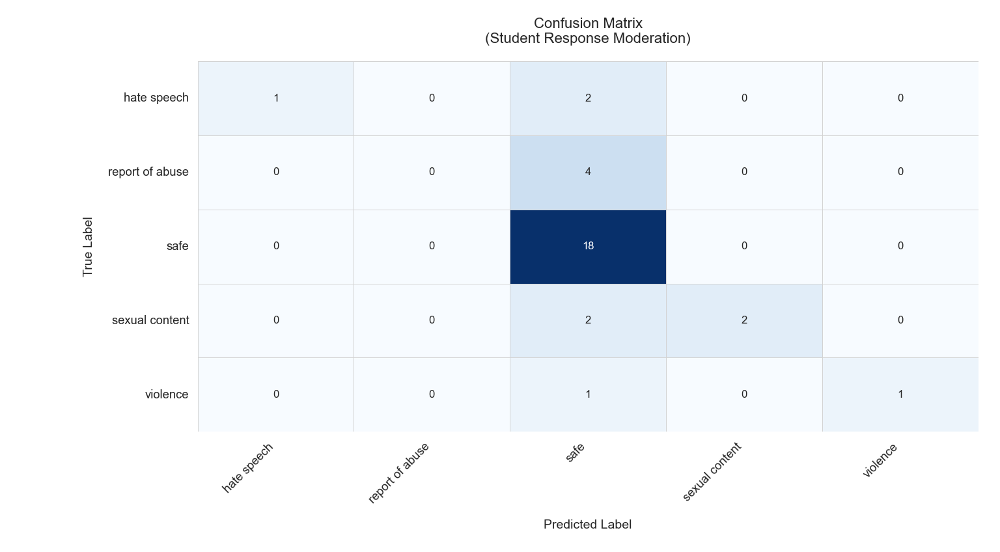
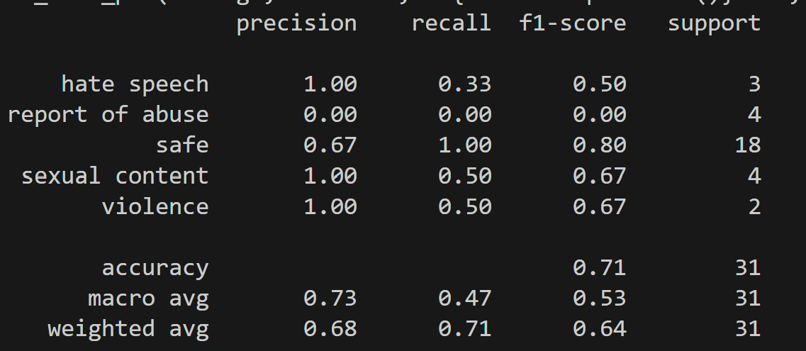
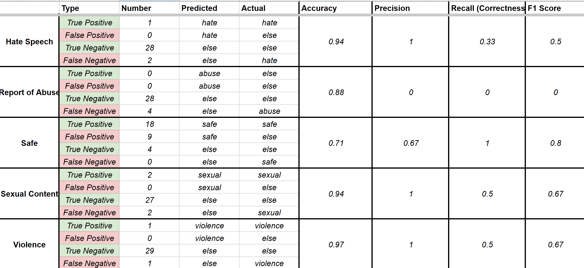
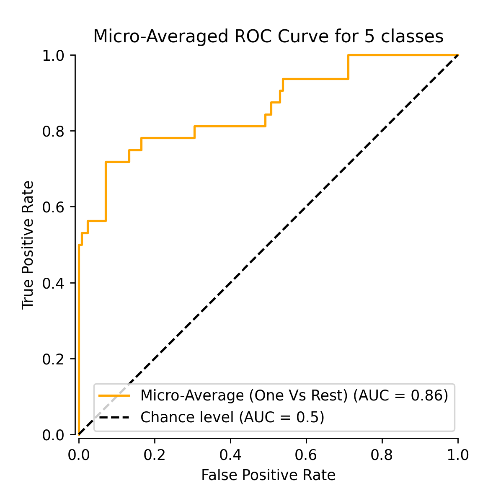
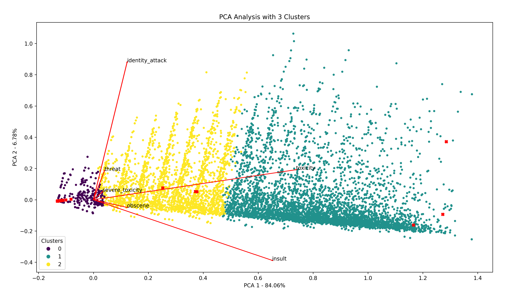

# Koala and Detoxify: Content Label and Severity Level Analysis

I will refer to our dataset as responses.json

Input Guard Rails:

## Our Data Set

Input data is expected in `respones.json` in the following structure:

```json
{
 "expected": "<expected_label>",
 "question": "<prompt>",
 "prompt_number":"<prompt #>"
}
```


# Koala Analysis
Koala was used for the predicition of several content labels:
The generation of the Weave report was done in `koala_analysis.py`
## Koala Dataset

Koala data is expected in `koala_training_set.json` in the following structure:

```json 
{
    "prompt": "<prompt>", 
    "S": "True/False",
    "H": "True/False",
    "V": "True/False", 
    "HR": "True/False",
    "SH": "True/False",
    "S3": "True/False",
    "H2": "True/False",
    "V2": "True/False",
}
```

Koala outputs 1 of 9 content labels: 

* H - Hate Speech
* H2 - Hate Speech / Threatening
* HR - Harrassment
* OK - Safe
* S - Sexual Content
* S3 - Sexual Content / Minors
* SH - Self Harm
* V - Violence
* V2 - Violence / Graphic Imagery

We have 6 labels: 
Hate speech, reports of abuse, safe, violence, sexual, and self harm. 

## Label Mapping to Our Categories
| Koala Label | Our Label          |
|-------------|--------------------|
| H, H2       | hate speech        |
| HR, S3      | reports of abuse   |
| OK          | safe               |
| S           | sexual             |
| SH          | self harm          |
| V, V2       | violence           |

## Weave Results
### Accuracy Function

Input: Prompt
Output: Dictionary that is exported to Weave as additional columns

1. *Match:* Expected Label and Mapped Label match. 
2. *Predicted Label:* Raw output from Koala 
3. *Mapped Label:* Converted label per our categories
4. *True Label:* Expected label from responses.json

After running the 32 examples, it intialized a weave report.

Image of the report

The report was exported and used in `koala_Weave_Generation.py`


## Data Analysis
### __Confusion Matrix__
To measure the performance of Koala against our data, a confusion matrix measured:

* Precision - 
* Recall - 
* F1 Value -

Because Precision and Recall are complements to both shortcomings, and F1 Score is a compiled version of both, we'll use F1 Score as a metric for which categories our model is predicting well. 

 
### Outputted Classifcation Report
Scikit-Learn has a designated classification report.
`` 



### Classification Table 
 


Besides the Confusion Matrix, we can look at the Receiver Operating Character (ROC) curve to
analyze how well our model distinguses between classes and the overall performance. 

Aggregated Probabilities: Because there is a class mismatch with Koala, we need to sum probabilities that correlate 
with the conversion table above. Then feed it into the Receiver Operating Characteristic (ROC) curve. (*Total probability <= 1*)

We use Micro-Averaging because our dataset classes are widely imbalanced. The Area Under Curve (AUC) metric indicates
how well our model distinguses between classes and the overall performance. 



Due to the class mismatch and need to estimate, this chart is not entirely accurate. More data is needed 
to truly assess the AUC metric. 

###

## Koala Conclusion

Based on the data analysis above. The model is:

* **Strong** with identifying 'Safe' 
* **Good** with identifying 'Sexual content', 'Violence', 'Hate Speech', 'Self Harm'
* **Poor** with identifying 'Reports of Abuse'

Koala doesn't directly have a reports of abuse possibility (We had to supplement with Harrassment or Sexual/Minors), so this makes sense. 
If we wantesd to increase the F1 Score or Accuracy for ethier column, we'd need to ethier finetune Koala with our data in a format it can understand, or use a different model.

# Detoxify Analysis 


## Detoxify Dataset
Detoxify's Dataset was sourced from their articles website of about 2M messages.  

Detoxify's Validation set originally contained 42 columns, most of which were racial identifers the model picked up on. Since the model doesn't
output that information, we can drop those columns. The model doesn't output sexually explicit score, so we can drop that. After dropping, we are left with these columns:

* Comment Text (Prompt)
* Toxicity Score
* Severe Toxicity Score
* Identity Attack Score
* Insult Score
* Threat Score
* Obscene Score

On their github, Detoxify has their datasets on Kaggle. I decicded to use their validation dataset for their ground-truth scores and *98,000* prompts. This is particularly useful for clustering the data into categories which can serve as severity labels.

Detoxify's Validation Set is sourced in `copy.csv`. After conversion to json, the following structure is:

## Clustering Possible Severity Labels

To cluster the validation set into severity labels. We can use **KMeans Clustering** 

1. KMeans Clustering 
    - Groups Data Points based on proximity to closeness to each other and seperation from each cluster. 
    - Minimizes variance within each cluster

### Generated Clusters

## Predicted Toxicity Scores and Severity Labels on our Dataset

Since the 6 predicted toxicity scores is a point in 6 dimensional space, we can categorize the point to the closest centroid by distance. 

Below are the results of our 32 labels in a csv. 


## Visualizing 6 Dimensional Data into a 2 Dimensional Graph. 

Purely for visualization purposes, how can we see the clusters **KMeans** has produced? 
Because our scores are 6 dimensional, we can apply **Principal Component Analysis (PCA)** to project our actual labels in a way a human can visualize. 


SciKit-Learn has a PCA function for this reason. 
```python
# Examples: PCA
X_pca = PCA(n_components=2).fit_transform(y_true)
plt.scatter(X_pca[:, 0], X_pca[:, 1], c=kmeans.labels_, marker='.')
```

The columns are...


## Detoxify Conclusion


