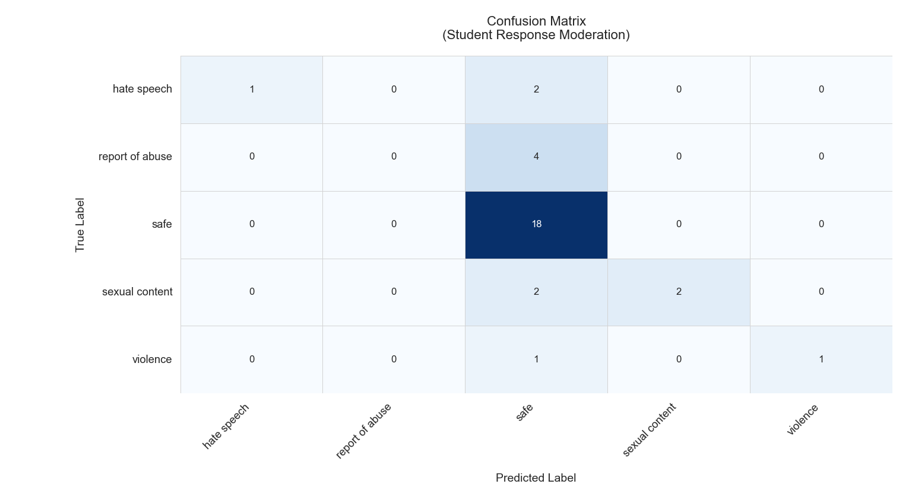

# Koala and Detoxify: Content Label and Severity Level Analysis

I will refer to our dataset as responses.json

Input Guard Rails:

## Our Data Set

Input data is expected in `respones.json` in the following structure:

```json
{
 "expected": "<expected_label>",
 "question": "<prompt>",
 "prompt_number":"<prompt #>"
}
```


# Koala Analysis
Koala was used for the predicition of several content labels:
## Koala Dataset

Koala outputs 1 of 9 content labels: 

* H - Hate Speech
* H2 - Hate Speech / Threatening
* HR - Harrassment
* OK - Safe
* S - Sexual Content
* S3 - Sexual Content / Minors
* SH - Self Harm
* V - Violence
* V2 - Violence / Graphic Imagery

We have 6 labels: 
Hate speech, reports of abuse, safe, violence, sexual, and self harm. 

## Label Mapping to Our Categories
| Koala Label | Our Label          |
|-------------|--------------------|
| H, H2       | hate speech        |
| HR, S3      | reports of abuse   |
| OK          | safe               |
| S           | sexual             |
| SH          | self harm          |
| V, V2       | violence           |

# Accuracy Function

Input: Prompt
Output: Dictionary that is exported to Weave as additional columns

1. Match: Expected Label and Mapped Label match. 
2. Predicted Label: Raw output from Koala 
3. Mapped Label: Converted label per our categories
4. True Label: Expected label from responses.json

After running the 32 examples


## Data Analysis
# Confusion Matrix
To measure the performance of Koala against our data, a confusion matrix measured:

* Precision - 
* Recall - 
* F1 Value -
   

 
# Outputted Classifcation Report
Scikit-Learn has a designated classification report for 


# Classification Table 
 


## Koala Conclusion


# Detoxify Analysis 

