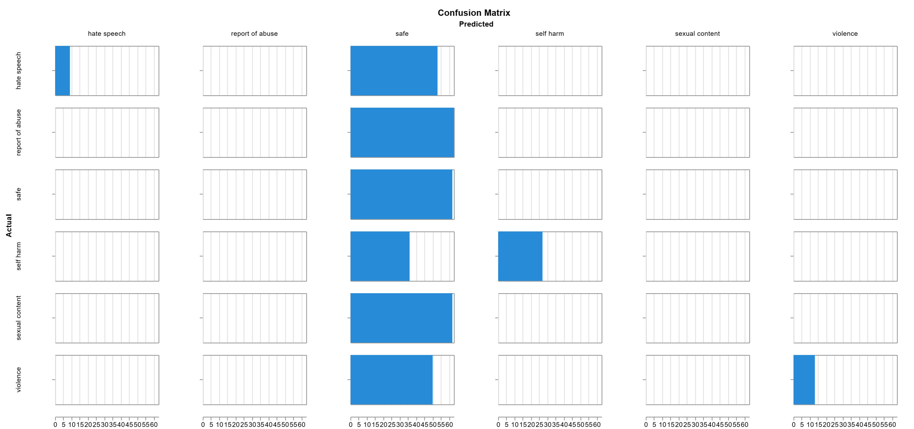

# LLamaGuard Analsyis
LLamaGuard was used for the predicition of several content labels:
The generation of the Weave report was done in `llamaguard_weave_generation.py`
## LLamaGuard Output

## LLamaGuard Mapping to Our Categories
We have 6 labels: 
Hate speech, reports of abuse, safe, violence, sexual, and self harm. 

Because LLamaGuard outputs 

A mapping scheme is defined in `config.json`. 

| LLamaGuard Label             | Our Label                        |
|------------------------------|----------------------------------|
| S1 - Violent Crimes          | violence, report of abuse        |
| S2 - None-Violent Crimes     | hate speech, violence            |       
| S3 - Sex-Related Crimes      | sexual content, report of abuse  |             
| S4 - Child-Sexual Exploit    | sexual content, report of abuse  |            
| S5 - Defamation              | violence                         |
| S9 - Indiscriminate Weaponry | violence                         |
| S10 - Hate                   | hate speech                      |
| S11 - Suicide/Self Harm      | self harm                        |
| S12 - Sexual Content         | sexual content                   |

# LLamaGuard 3 8B Parameter Model

## Weave Analysis

After running the weave diagonostic, average latency was 

### Confusion Matrix

Below is an image of the confusion matrix, and the associated classification reports generated. You can find these reports
in `Runs -> Most Recent Run.` 

 

# LLamaGuard 3 8B Model VS LLamaGuard 4 12B Model

We also tried out LLamaGuard 4, Meta's newest LLamaGuard iteration model, on our data. 
Overall, it performeed slightly better than LLamaGuard 3-7B, but took s 

Weave shows an interactive comparison between the models, including a bar comparison confusion matrix and side-by-side classification metrics.
These comparisons make it easy to identity the categories both models excel and fail at. 
- Green: LlamaGuard 4
- Yellow: LLamaGuard 3
 

**Classification Metrics (8B vs 12B)**

* **Accuracy:** Proportion of all classifications that were correct   $\frac{TP+TN}{TP+FP+TN+FN}$
* **Precision:** Proportion of all the model's positive classifications that are actually positive. $\frac{TP}{TP+FP}$ 
* **Recall:** Proportion of all actual positives that were classified correctly as positives. *Better with imbalanced class datasets* $\frac{TP}{TP+FN}$ 
* **F1-Score:** Harmonic mean of precision and recall, preferable to accuracy. $2 * \frac{precision * recall}{precision + recall}$ 

|                   | Precision (8B) | Recall (8B) | F1-Score (8B) | Precision (12B) | Recall (12B) | F1-Score (12B) |           
|-------------------|----------------|-------------|---------------|-----------------|--------------|----------------|
| Hate Speech       |   1            | 0.145       |  0.254        |  1              |  0.08        |  0.149         |
| Report of Abuse   |   0            |   0         |  0            |  0              |  0           |  0             |
| Safe              |   0.19         |   1         |  0.32         |  0.197          |  1           |  0.329         |
| Self Harm         |   1            | 0.429       |  0.6          |  0.97           |  0.51        |  0.667         |
| Sexual Content    |   0            |   0         |  0            |  0              |  0           |  0             |
| Violence          |   1            | 0.206       |  0.342        |  1              |  0.33        |  0.5           |

Both models fail at detecting prompts classified as sexual content and reports of abuse.
Both models correctly identified all safe prompts. 
* LLamaGuard 4 performed higher in violence: (10 more than LLamaGuard 3)
* LLamaGuard 4 performed higher in self harm: (5 more than LLamaGuard 3)
* LLamaGuard 4 performed lower in hate speech: 

While the 12B model overall performs better, the latency tradeoff is too high, and would make LLamaGuard 4 unsustainable in production for our current dataset. 
Thus, LLamaGuard 3 and LLamaGuard 4 models are not suitable for our current dataset. These guardrail models seem to flag more severe content, struggling with identifying more tame responses, similar to that of our dataset.

